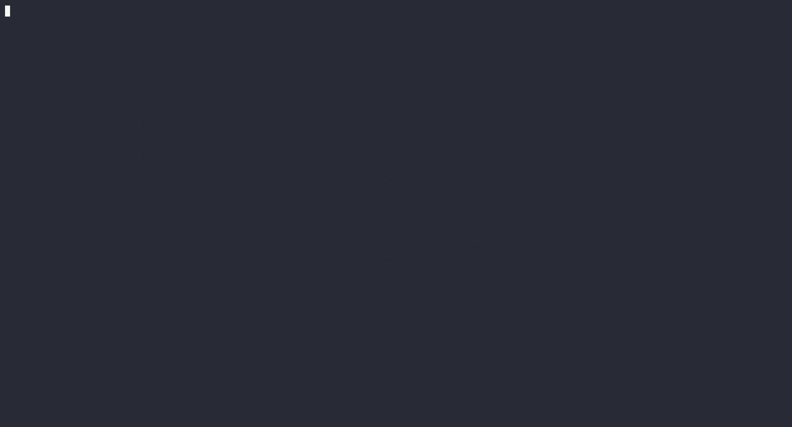
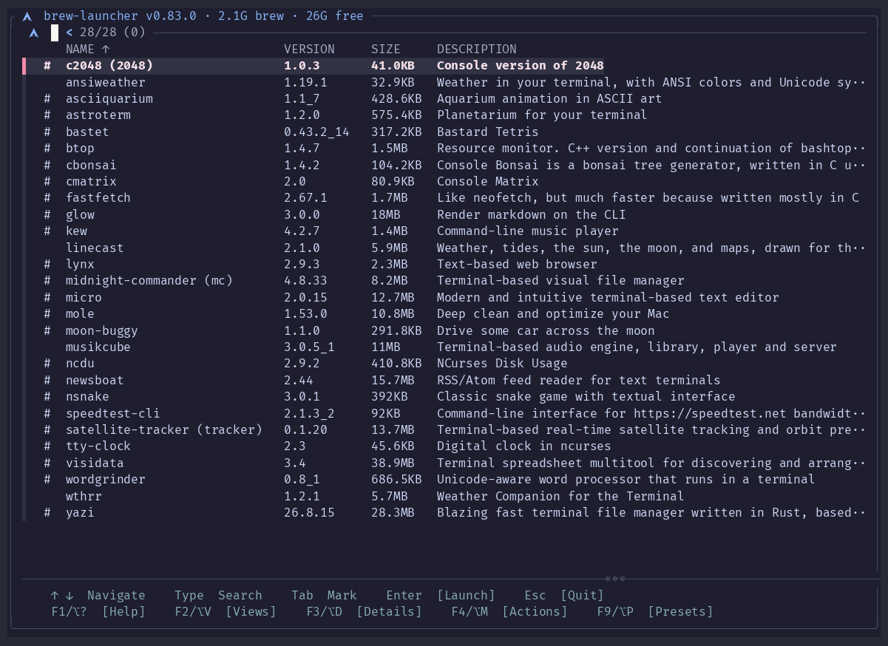
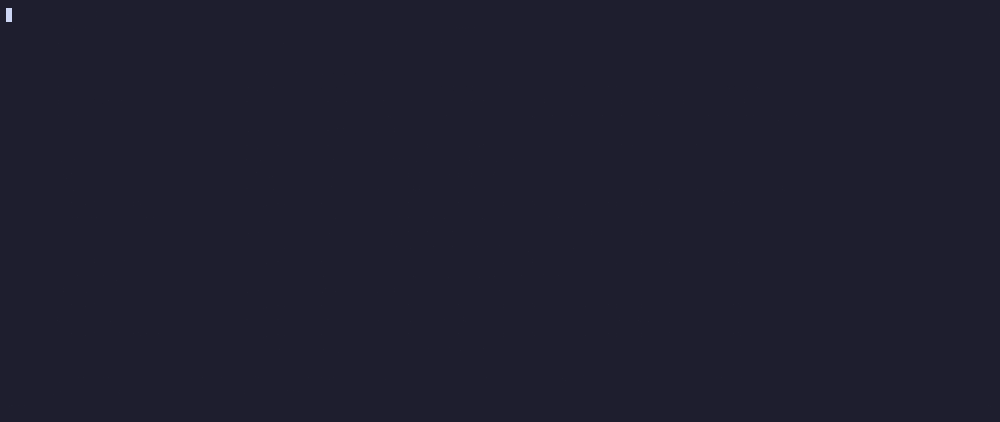
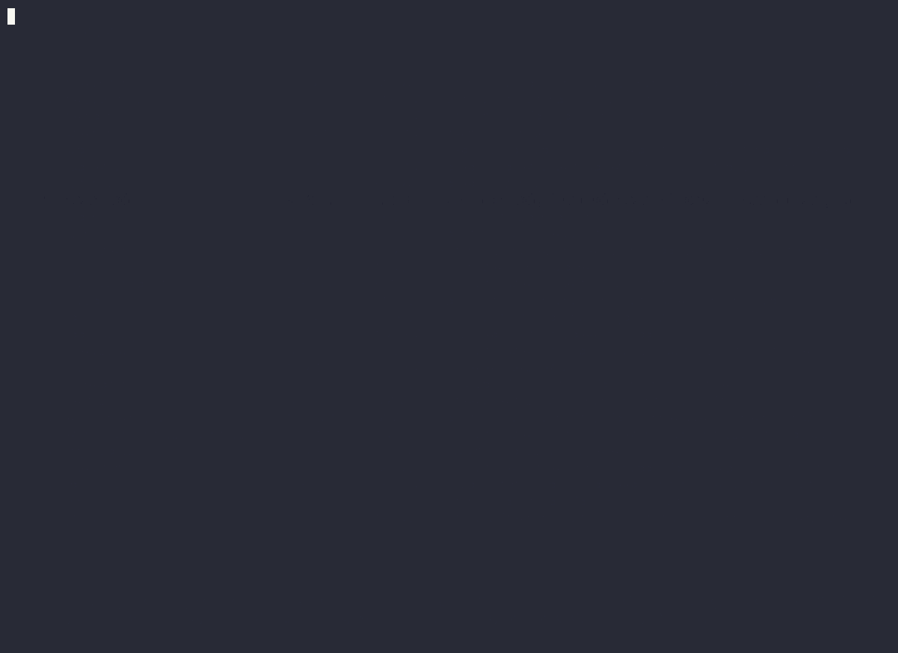
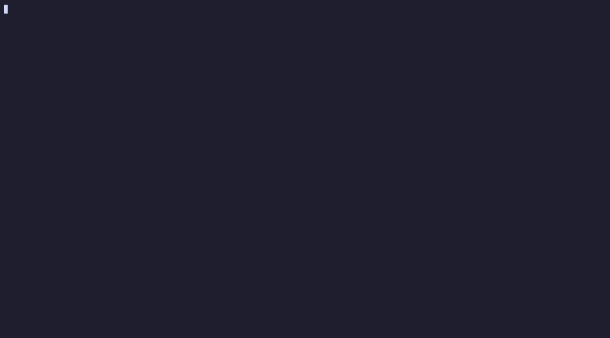
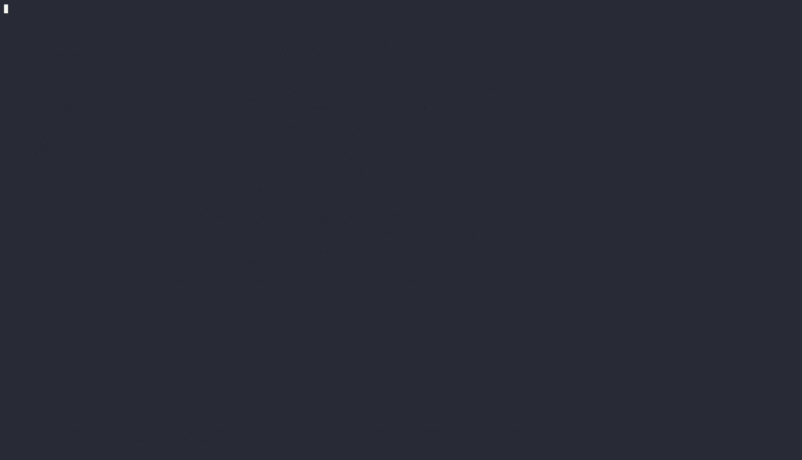
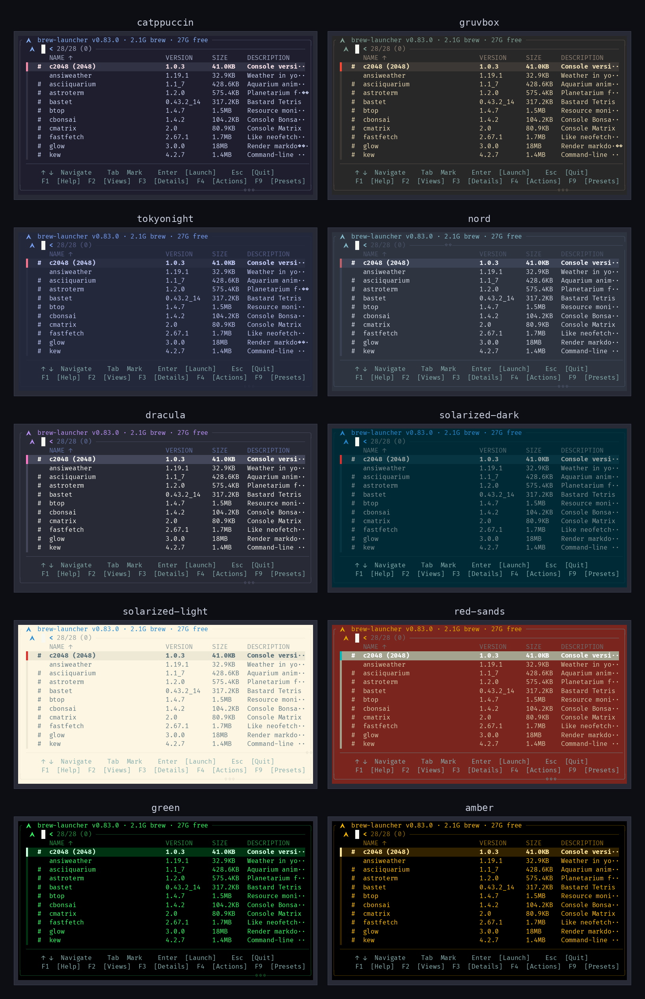

<h1 align="center">brew-launcher</h1>

<p align="center">
  <strong>You installed 40 terminal tools. You remember six.</strong><br>
  A fast launcher for the Homebrew CLI apps you already have — browse, search, and run them without remembering names.
</p>

<p align="center">
  <a href="https://github.com/ltdan-88/brew-launcher/releases"></a>
  <a href="LICENSE"></a>
  
  <a href="https://github.com/ltdan-88/brew-launcher/actions"></a>
</p>

<p align="center">
  
</p>

## Why this exists

`brew list` gives you names. That's the problem — six months later, `bbrew`,
`bastet` and `mole` are just words, and the tool you actually wanted stays
installed and unused.

`brew-launcher` shows you the same list **with what each thing actually does**,
its version, and its size — then launches it.

```
bastet          0.43.2_14   317.2KB   Bastard Tetris
bbrew           2.3.2       7.9MB     TUI for managing Homebrew, Flatpak, and Mac App Store packages
mole            1.51.0*     9.7MB     Deep clean and optimize your Mac
```

**This is a launcher, not a package manager.** If you want to *install and
remove* Homebrew packages interactively, [`taproom`](https://github.com/hzqtc/taproom)
and [`fzf-brew`](https://github.com/thirteen37/fzf-brew) already do that well.
This one is for the tools you've *already* installed and want to actually use.

It's a single zsh file. No daemon, no database, nothing you *have to*
configure — startup is instant after the first run.

## Quick start

```bash
brew install ltdan-88/brew-launcher/brew-launcher
brew-launcher
```

That's it — nothing to configure. Type to search, **Enter** to launch, **Esc** to quit.

**Requirements:** macOS or Linux · [Homebrew](https://brew.sh/) · python3 (already on most systems).
[fzf](https://github.com/junegunn/fzf) is installed automatically as a dependency.
Optional: [tmux](https://github.com/tmux/tmux), only if you use the tmux terminal
backend or Presets — see [Configuration](#configuration). Full platform/backend
matrix, including what's macOS-only vs. Linux-only: [COMPATIBILITY.md](COMPATIBILITY.md).

## What you get

### Everything you installed, described

<p align="center"></p>

Only tools **you** asked for — dependencies pulled in by other formulae are
filtered out. Search matches names *and descriptions*, so typing `weather`
finds tools that never mention it by name.

| Marker | Where | Meaning |
|---|---|---|
| `*` | after the version (`1.13.0*`) | Outdated — a newer version exists |
| `+` | before the name | Favorited |
| `#` | before the name | Categorized |

`+` and `#` can appear together (`+#`). These just describe state — upgrading
stays Homebrew's job.

- **F4 → Actions → Settings → Sort** — alphabetical or by size, each with its own ascending/descending direction (name ascending is the default). Clicking the **NAME** or **SIZE** column header does the same thing directly: picks that column, and clicking it again reverses direction — without opening Settings.
- **F4 → Actions → Settings → Compact View** — hides version/size and the `+`/`#`/`*` markers, leaving just name and description.
- The top border shows Homebrew's total disk usage and free space, and gets
  its own `*` once a newer brew-launcher is available (`brew upgrade brew-launcher` clears it).

### Two tiers of keys, plus Settings

<p align="center"></p>

The footer covers browsing: **Help**, **Views**, **Details**, **Actions**,
**Presets**. Everything else — hide, favorite, categorize, create a preset or
shortcut, back up, and every standing preference — lives behind
**F4 / ⌥M → Actions**, named after whatever's highlighted (`Actions on fastfetch`).

- **Hide / Favorite / Categorize** (F6/F7/F8) also work directly, without opening the menu.
- **Tab marks a row** (right-click, or Control-click on a Mac trackpad, does the same thing with a mouse). Every action then acts on whatever's marked, or on the highlighted row when nothing is — so hiding, favoriting, categorizing, updating or making shortcuts for a batch is the same key as doing one, just with marks set first. The two actions that can't apply to several (Launch Flags, Run With Args) say so rather than quietly acting on one. Marks clear once the action runs. The footer updates the instant something is marked — how many, and that Enter now launches them together — so marking a row for the first time doesn't require already knowing what comes next.
- **Create Preset**, **Create Shortcut**, and the bulk actions above only appear when there's an actual list of tools to act on — not from the view picker.
- **Settings** is its own screen, one level down, holding every on/off preference: Theme, Default Categories, Default Hidden, Open to Categories, Sort, Details, Details Position, Alt Keybinds. Toggles flip with Space or Enter and reopen Settings right after.
- **F4**, **F5**, and **F9** also work from inside the view picker (**F2**).

### One place to switch views

<p align="center"></p>

**F2** opens the view picker: `All`, then `Most Used`, `Recently Launched`,
and `Recently Added`, then `Favorites`, your own categories (marked `·`), and
`Hidden` last. Every row shows a count.

- `Most Used`, `Recently Launched`, and `Recently Added` are computed automatically — by launch count, by when you last launched something, and by install date — capped at 15 tools each.
- **F3** previews what's inside the highlighted category, including tools filed there only via [bundled defaults](#bundled-defaults).
- **Ctrl-R** renames a category, **Ctrl-D** deletes it (asks first, shows the count). Built-in views can't be renamed or deleted.
- **F4 → Actions → Settings → Open to Categories** starts here instead of `All`.

### Favorites

<p align="center"></p>

**F7** toggles a favorite instantly. **F8** does the same for any other
category. For several at once, mark them with **Tab** first and press the same
key — see [Two tiers of keys, plus Settings](#two-tiers-of-keys-plus-settings).

Uninstalling a favorited or categorized tool removes it from that list on the
next cache rebuild (`--refresh`, **F5**, or the periodic background one).

### Hide what you don't use

<p align="center"></p>

**F6** hides an entry — it stays installed, Homebrew is untouched. Hidden is
just another view: **Enter** still launches, **F6** unhides.
Mark several with **Tab** first to hide them all in one press.

### Already organized on day one

A curated set of well-known formulae ships pre-categorized, and a short list
of commands that are just a multi-command formula's minor helper scripts
ships pre-hidden — so a fresh install already looks organized. Your own
**F6**/**F8** choice on any entry always overrides the bundled default. Turn
either mechanism off from **F4 → Actions → Settings → Default Categories** /
**Default Hidden** — see [Bundled defaults](#bundled-defaults) for specifics.

### The full details, without leaving

<p align="center"></p>

**F3** opens a details pane below the list — homepage, license, size, tap,
when *you* installed it, dependencies, caveats — following the cursor as you
move. Instant, since it's written when the cache builds. Also shows an
`Update available` version number, which categories/presets an entry belongs
to (marked `(default)` if only via [bundled defaults](#bundled-defaults)),
and closes on the first Esc rather than exiting the screen.

- **Shift-Up** / **Shift-Down** scrolls it. Starts closed; **F4 → Actions → Settings → Details** makes it a standing choice instead of a peek.
- **F4 → Actions → Settings → Details Position** switches it to open above the list instead of below, everywhere it appears.

### Launch without leaving the launcher

On macOS with [Ghostty](https://ghostty.org/), launching a tool opens a
**new tab**. Inside tmux, `BREW_LAUNCHER_TERMINAL=tmux` opens a **new
window**. Everywhere else it launches in place — see
[Configuration](#configuration).

What happens when the tool quits depends on which of those it was. Launching
in place, quitting brings the launcher right back — pausing first with
**press any key to return to brew-launcher** so a one-shot CLI's output isn't
wiped instantly, since the picker's own redraw is about to take over that
same screen. A new tab or window is different: the launcher you started it
from is still running there, untouched, so quitting just closes the tab or
window instead of standing up a second one — pausing first with **press any
key to close this tab/window**, same reason as above, then closing itself
with nothing further to do.

### Launch several tools together

<p align="center"></p>

A preset is a named group of tools that all open together, one per tmux pane
— your morning setup in one shot instead of launching each tool by hand.

For a one-off, you don't need a preset at all: mark a few tools with **Tab**
and press **Enter**, and they open together the same way. Presets are for a
grouping worth keeping; marking is for right now — detaching (`prefix+d`)
from a one-off closes it out rather than keeping it running in the
background, since unlike a saved preset there's no F9 entry to bring it back.

- **F4 → Actions → Create Preset** — Tab marks a tool and numbers the launch order; Enter saves it. Anything already marked on the main list arrives pre-numbered, ready to reorder. Only offered when there's an actual list to build from.
- **F9** lists your presets and launches the one you pick, in its own window
  or reattaching if it's already running (see [Configuration](#configuration)). Its own always-on details pane previews a preset's numbered contents.
- **Ctrl-E** on a highlighted preset rearranges it (same Tab-to-mark screen, seeded with its current members) — add or drop tools too, not just reorder.
- **Ctrl-R** renames it, **Ctrl-D** deletes it (asks first).
- Needs [tmux](#terminal-backends). **F9** and **Create Preset** stay visible either way and explain the install command if it's missing.

### Custom launch flags

**F4 → Actions → Launch Flags** on a highlighted entry sets extra arguments
to always pass it when it launches (`--tree`, `-w /some/path`, whatever the
tool takes). Prefilled with whatever's already set; blank + Enter clears it.
Stored per command, so it applies everywhere that command launches from —
the main list's own Enter, and any preset it's a member of.

### Run With Args

**F4 → Actions → Run With Args** on a highlighted entry launches it right now
with extra arguments, just this once — a one-off, distinct from the standing
[Launch Flags](#custom-launch-flags) setting. Prefilled with the current
Launch Flags value as a starting point; blank + Enter just runs it plain.

**F3 / ⌥D** from that prompt previews the tool's own `--help` output, on
demand only — not automatically, since some installed tools (games,
animations) might launch straight into their own full-screen mode instead.

### Color themes

<p align="center"></p>

Ten built-in palettes: `catppuccin` (default), `gruvbox`, `tokyonight`,
`nord`, `dracula`, `solarized-dark`, `solarized-light`, `red-sands`, and two
monochrome CRT themes, `green` and `amber`. There's also `custom`, for your
own palette — config-file-only, not one of the ten scrollable rows below.

**F4 → Actions → Settings → Themes** shows a description next to each name
and where the current one sits (`3 of 10`), picks instantly with no terminal
needed, and offers to relaunch. Env var and config-file syntax are in
[Configuration](#configuration), including `custom`'s own `CUSTOM_COLORS=`
line.

### Desktop shortcuts

**F4 → Actions → Create Shortcut** makes a tool double-clickable outside the
launcher — a `.command` file in `/Applications/TUIs/` on macOS, a
`.desktop` entry in `~/.local/share/applications/` on Linux (appears in your
application menu with no further setup). A one-shot CLI's output stays
readable either way: the window drops to a live shell after, instead of closing.

### Update everything at once

**F4 → Actions → Update All** runs `brew upgrade` for everything outdated, in
a real terminal so you see its output. Shows the outdated count, asks first,
and relaunches afterward like any other launch.

**F4 → Actions → Update** does the same for just the highlighted entry — no
confirmation, since it's scoped to one tool. Shows the new version in its own
row when one's available; already up to date just says so.

### Launch history

**F4 → Actions → Launch History** shows what's been recorded — each tool and
how many times you've launched it — and can clear the whole thing (**Ctrl-D**,
with a confirm). This is what Most Used and Recently Launched are built from,
so clearing means both start over. The row itself shows the total, so you can
see how much is recorded without opening it.

### Backup

**F4 → Actions → Backup** writes one file, always
`~/brew-launcher-backup.tar.gz` (overwritten each run — point a synced folder
at it once and forget about it), containing:

- A Brewfile from `brew bundle dump`: every installed formula, cask and tap,
  including the tap this launcher itself comes from.
- `brew-launcher-config/`, a copy of `~/.config/brew-launcher` — categories,
  presets, hidden entries, favorites, theme, terminal backend.

Restoring on a fresh machine: untar the archive, run
`brew bundle install --file=Brewfile`, then copy `brew-launcher-config` back
to `~/.config/brew-launcher`.

### Factory Reset

**F4 → Actions → Factory Reset** wipes every category, favorite,
hidden/shown entry, preset, launch flag, and recorded launch, and resets
theme/sort/terminal preferences back to their defaults — everything back to
how it looked freshly installed. Asks first, showing exactly how much of
each it's about to remove, and can't be undone — run **Backup** first if you
want to keep a copy.

### Mouse support

Click a row to select it, double-click to launch, right-click to mark it
(same as Tab — on a Mac trackpad, **Control-click** works too, since that's
the traditional right-click equivalent there). Footer items in `[brackets]`
are clickable and do exactly what the key beside them does. Clicking the
**NAME** or **SIZE** column header sorts by it directly, same as Actions →
Settings → Sort — click the same one again to reverse direction, shown as a
small **↑**/**↓** right on the active column's own label.

## Reference

**F1** (no alias needed — it means *help* nearly everywhere) opens the same
reference below, from inside the launcher — split into a few short topics
(Keys, Actions Menu, Settings Reference, Mouse & Good to Know) rather than
one long scrolling list.

| Key | Action | |
|---|---|---|
| **Enter** | Launch selected application | footer |
| **F1** / **⌥?** | Open this reference in the launcher — also in the footer, first | footer |
| **F2** / **⌥V** | Switch view (All · Favorites · categories · Hidden) | footer |
| **F3** / **⌥D** | Show or hide the details pane | footer |
| **Shift-Up/Down** | Scroll the details pane | footer |
| **Esc** | Go back one level; on `All`, asks Quit or Cancel first | footer |
| **F4** / **⌥M** | Open the Actions menu — also works from the view picker | footer |
| **F9** / **⌥P** | Launch a preset (reattaches if it's already running) — also works from the view picker; its own details pane is always on, previewing what's in the highlighted preset | footer |
| **Ctrl-E** | Rearrange (add/remove/reorder tools in) the highlighted preset — in the F9 picker | picker |
| **Ctrl-R** | Rename the highlighted preset — in the F9 picker | picker |
| **Ctrl-D** | Delete the highlighted preset — in the F9 picker | picker |
| **F5** / **⌥R** | Refresh the cache — also works from the view picker; not in the footer, but always available directly | Actions |
| **F6** / **⌥H** | Hide — or unhide, in the Hidden view | Actions |
| **F7** / **⌥F** | Toggle Favorites for selected entry | Actions |
| **F8** / **⌥C** | Categorize selected entry (adds or removes) | Actions |
| **F3** | Preview what's in the highlighted category — in the F2 picker | picker |
| **Ctrl-R** | Rename the highlighted category — in the F2 picker | picker |
| **Ctrl-D** | Delete the highlighted category — in the F2 picker | picker |
| **Tab** | Mark/unmark a row — actions then apply to everything marked | footer |
| **Enter** | With several marked: launch them all together, one per tmux pane | footer |
| — | Create a new preset | Actions only |
| — | Create a desktop shortcut (macOS or Linux) — one per marked entry | Actions only |
| — | Set custom launch flags for the highlighted entry | Actions only |
| — | Run the highlighted entry with one-off extra arguments | Actions only |
| **F3** / **⌥D** | Preview that entry's own `--help` output | Run With Args only |
| — | Update the highlighted entry, or every marked one, in a single brew run | Actions only |
| — | Update All — run brew upgrade for everything outdated | Actions only |
| — | Open Settings | Actions only |
| — | Back up installed apps + launcher config to one file | Actions only |
| — | View the launch history and how often each tool was used, or clear it | Actions only |
| — | Factory Reset — wipe every category, favorite, hidden entry, preset and preference back to defaults (asks first) | Actions only |
| — | Switch color theme | Settings only |
| — | Toggle Default Categories / Default Hidden | Settings only |
| — | Toggle Open to Categories | Settings only |
| — | Sort by name or size, each ascending or descending (Space cycles all four) | Settings only |
| — | Click the **NAME** or **SIZE** column header to sort by it, click again to reverse | header |
| — | Toggle Compact View (hide version/size columns and +/#/\* markers) | Settings only |
| — | Toggle the details pane (mirrors F3) | Settings only |
| — | Toggle where the details pane opens — top or bottom | Settings only |
| — | Toggle Alt Keybinds (show/hide the ⌥ aliases in the footer) | Settings only |

Each Option alias matches its label — **⌥H**ide, **⌥V**iews, **⌥P**resets,
**⌥R**efresh, **⌥F**avorite, **⌥C**ategorize, **⌥D**etails. They exist because
F-keys need Fn on most Mac laptops. In stock Terminal.app, enable *Use Option
as Meta Key* in the profile's Keyboard settings first; Ghostty supports it out
of the box.

<details>
<summary>Why the keys are split this way</summary>

**F1** means *help* nearly everywhere, so it leads the footer — same order it
numbers in. **F2**–**F4** plus **F9** follow because those are the ones you
press constantly, and they're the easiest to reach on a laptop that needs
**Fn**.

The split is by what you're doing, not by how often. Finding, browsing, and
running something, together with launching a preset, are what you open the
launcher for, so those stay on screen. Organizing and setup are things you do
in bursts, so they moved to Actions instead of costing a footer slot on every
launch. Full history of these changes is in [CHANGELOG.md](CHANGELOG.md).

The footer also adapts to the terminal, dropping the marker legend and then
the Option aliases rather than letting fzf cut an item off mid-word. The view
picker (**F2**) and preset picker (**F9**) degrade the same way. Create
Shortcut isn't offered on any platform besides macOS and Linux, since there's
nowhere to put the result elsewhere.

</details>

```bash
brew-launcher --refresh          # rebuild the application cache
brew-launcher --list             # tab-separated plain text, for scripting
brew-launcher --preset devops    # launch a preset directly, no picker
brew-launcher --diagnose         # check dependencies, config and cache health
brew-launcher --help
```

## Configuration

Nothing here is required reading — everything in the launcher works with zero
configuration. Expand this if you want to change the terminal backend, theme,
bundled-defaults behavior, or preset file format.

<details>
<summary><strong>Show configuration details</strong></summary>

The in-app keys (Theme, Create Preset) write these files for you. They're
plain text if you'd rather edit them directly, one setting or command per
line, `#` comments and blank lines ignored:

```
~/.config/brew-launcher/config              # TERMINAL=, THEME=, CUSTOM_COLORS=, DEFAULT_CATEGORIES=, DEFAULT_HIDDEN=, OPEN_TO_CATEGORIES=, SORT=, ALT_KEYBINDS= — see below
~/.config/brew-launcher/ignore               # hidden entries
~/.config/brew-launcher/shown                # bundled-hidden commands you F6'd back visible
~/.config/brew-launcher/category-exclude     # commands excluded from a bundled-only category via F8
~/.config/brew-launcher/categories/<name>    # one file per category
~/.config/brew-launcher/categories/Favorites
~/.config/brew-launcher/launch-history       # one line per launch, powers Most Used and Recently Launched
~/.config/brew-launcher/presets/<name>       # one file per preset — see below
```

`config` and `presets/<name>` are the only files here you'd ever write
yourself. An env var (`BREW_LAUNCHER_TERMINAL`, `BREW_LAUNCHER_THEME`) always
wins over what `config` says, for that one run. Categories match on
**command** name, not formula name — one formula can provide several commands
(`midnight-commander` provides `mc`). Use `brew-launcher --list` to look one up.

### Terminal backends

By default the best available option is chosen: Ghostty on macOS if installed,
otherwise the current terminal — **unless you're connected over SSH**, where
there's no display to open a Ghostty window in even if it's installed on the
machine. Override with `BREW_LAUNCHER_TERMINAL`:

```bash
export BREW_LAUNCHER_TERMINAL=auto      # default
export BREW_LAUNCHER_TERMINAL=current   # run in this terminal
export BREW_LAUNCHER_TERMINAL=ghostty   # new Ghostty tab (macOS)
export BREW_LAUNCHER_TERMINAL=tmux      # new tmux window
```

`tmux` is deliberately opt-in only — it never starts a tmux session for you.
Use it while you're already inside one and it opens tools in a new window
alongside the launcher; run it outside tmux and it just falls back to
`current`, same as if you hadn't set it.

`auto` itself is SSH-aware, so this is usually nothing you need to set by
hand: connected over SSH (detected via the standard `SSH_TTY`/
`SSH_CONNECTION`/`SSH_CLIENT` env vars) and already inside a tmux session, it
picks `tmux`; over SSH without one, `current`.

### Theme

```bash
export BREW_LAUNCHER_THEME=nord   # for one session
```

```
# ~/.config/brew-launcher/config
THEME=nord
```

Valid names: `catppuccin`, `gruvbox`, `tokyonight`, `nord`, `dracula`,
`solarized-dark`, `solarized-light`, `red-sands`, `green`, `amber`, `custom`.
An unrecognized name fails fast rather than silently falling back, matching
`BREW_LAUNCHER_TERMINAL`'s own convention.

`custom` reads its palette from a `CUSTOM_COLORS=` config-file line instead
of a built-in one — there's no `BREW_LAUNCHER_CUSTOM_COLORS` env var, and it
isn't offered as a row in Settings → Themes, since there's nothing to show a
description for. The value is fzf's own `--color` format, comma-separated,
same 15 keys every built-in theme above sets:

```
# ~/.config/brew-launcher/config
THEME=custom
CUSTOM_COLORS=fg:#cdd6f4,bg:#1e1e2e,fg+:#f5e0e6,bg+:#313244,hl:#89b4fa,hl+:#89b4fa,info:#a6adc8,prompt:#89b4fa,pointer:#f38ba8,marker:#a6e3a1,spinner:#f5c2e7,header:#a6adc8,border:#45475a,label:#89b4fa,query:#f5e0e6
```

(That template is `catppuccin`'s own palette — copy it and swap in your own
hex values.) `THEME=custom` with no `CUSTOM_COLORS` line fails fast too,
same reasoning as an unrecognized theme name: there's no sensible default to
fall back to for a palette that's supposed to be yours.

### Bundled defaults

A curated, hand-reviewed dataset ships with the launcher: a formula ->
category mapping for ~140 well-known CLI/TUI tools, and a short list of
commands that are genuinely just a multi-command formula's minor helper
scripts rather than something worth surfacing on its own (`age-inspect`,
`calcurse-upgrade`, `chkfont`, and a handful of others — reviewed one at a
time, not filtered by a generic naming rule; see
[CONTRIBUTING.md](CONTRIBUTING.md) for why a blanket heuristic was rejected
instead). Both apply automatically, on every cache rebuild, to anything you
haven't already touched yourself — a fresh install already looks organized
without any setup.

Two switches control it: `Actions → Settings → Default Categories` and
`Actions → Settings → Default Hidden` (`DEFAULT_CATEGORIES` /
`DEFAULT_HIDDEN` in `config`, each `on`/`off`, default `on`). Your own F6
(hide) or F8
(categorize) choice on any individual entry always overrides the bundled
data for that entry, no matter what these two settings say — they're only
an escape hatch for someone who wants none of it applied, anywhere, from
the start.

A category that's entirely bundled (no real file behind it yet) still
shows up in the view picker and takes an F8 press like any other one:
pressing it again on a bundled-only membership excludes just that command
from the bundled category, rather than writing a redundant real entry.

### Presets

```bash
brew-launcher --preset devops
```

reads `~/.config/brew-launcher/presets/devops`, one command per line:

```
# ~/.config/brew-launcher/presets/devops
btop
lazygit
lazydocker
```

Every command opens as its own pane in one tmux session. Exactly 2 panes go
side by side (`even-horizontal`); 3 or more use tmux's own `tiled` grid
layout. Unlike `BREW_LAUNCHER_TERMINAL=tmux` above, naming a preset on the
command line *is* the opt-in — it always starts (or reattaches to) a tmux
session. Re-running an unchanged preset while it's still running reattaches
you to it rather than spawning a duplicate; editing the preset first rebuilds
the session fresh instead.

The status bar is forced on for every preset session (regardless of your own
tmux config), always naming the session (`blpreset-<name>`), and mouse mode
is turned on scoped to that session only. **prefix + z** zooms the focused
pane to fill the window and back; **prefix + Ctrl-arrow** resizes a border.
Default prefix is Ctrl-b unless your tmux config remaps it.

**How a preset actually shows up on screen depends on how you're connected**
— a multi-pane preset earns its own window rather than swallowing whatever's
already open, whenever there's somewhere to put one:

- **Local Mac with Ghostty** — opens a brand new Ghostty **window** (never a
  tab). The launcher you ran it from keeps running exactly as it was. For a
  saved preset, closing or detaching from that window later relaunches the
  launcher right there, ready to reattach again via F9. For a one-off
  Tab-and-Enter launch there's no F9 entry to reattach to, so detaching
  instead closes the window and ends the session — same as quitting a
  single tool.
- **Over SSH (or no Ghostty), already inside a tmux session** — your client
  switches to the preset's session instead. Detaching (**prefix + d**) later,
  or the preset session ending, relaunches the launcher in the window you
  switched from — for both a saved preset and a one-off, since this reuses
  that same window rather than opening a separate one.
- **Over SSH (or no Ghostty), not inside tmux** — takes over the current
  window, since there's no GUI to open a window in and no existing tmux
  session to switch within. Says so before doing it. Detaching or the preset
  ending relaunches the launcher right there too. Run brew-launcher itself
  inside a tmux session (`tmux` then `brew-launcher`) to get the
  switch-instead-of-takeover behavior above — this is exactly the setup
  [BREW_LAUNCHER_TERMINAL=tmux](#terminal-backends) is for.

Detecting "connected over SSH" uses the standard `SSH_TTY` / `SSH_CONNECTION`
/ `SSH_CLIENT` environment variables — the same signal most SSH-aware tools
check.

</details>

## How it works

Curious how it stays instant with no daemon and no database? Expand this —
otherwise, nothing here changes how you use it.

<details>
<summary><strong>Show the caching internals</strong></summary>

Homebrew is queried once and the result cached, so startup after the first run
is effectively instant. Whether anything was installed or removed is then only
re-checked every 60 seconds rather than on every launch. A tool installed in
the last minute can take up to that long to appear; **F5** refreshes
immediately if you don't want to wait. The "update available" check runs on
its own separate schedule so it can't go stale for days.

Discovery walks each formula's `opt/<name>/bin`, keeps executables that are
actually reachable on your `PATH`, and drops obvious helper binaries. Only
formulae you installed on purpose are listed. The same pass stamps each entry
with its bundled category and hidden status — see [Bundled
defaults](#bundled-defaults) — so nothing extra runs later just to apply
them.

One zsh file plus a small Python helper for parsing Homebrew's JSON — no
Node, no Rust, no daemon, no SQLite.

<details>
<summary><strong>Automator launcher (macOS)</strong></summary>

`extras/Brew Launcher.applescript` turns the launcher itself into a
double-clickable app:

1. Open **Automator** → new **Application**
2. Add a **Run AppleScript** action
3. Paste the contents of `extras/Brew Launcher.applescript`
4. Save as `Brew Launcher.app`, then add it to the Dock or bind a hotkey

It opens `brew-launcher` in a new Ghostty tab.
</details>

</details>

## Troubleshooting

**Not sure what's wrong.** Run `brew-launcher --diagnose` first — it checks
dependencies (required and optional), which terminal backend `auto` actually
resolves to on your machine, and whether the config/cache directories exist,
are writable, and are in the shape the launcher expects. It works even if a
dependency is missing, so it's the right first step whether the launcher
won't start at all or something just looks off.

**A tool I installed isn't listed.** Only formulae installed *on purpose* appear
— if it came in as a dependency it's filtered out. Run `brew-launcher --refresh`
if you installed it very recently.

**The ⌥ shortcuts do nothing.** In stock Terminal.app, enable *Use Option as
Meta Key* in the profile's Keyboard settings. The F-keys work regardless.

**Nothing launches in a new tab.** That's Ghostty-only, and macOS must allow
brew-launcher to control Ghostty (System Settings → Privacy & Security →
Automation).

**`BREW_LAUNCHER_TERMINAL=tmux` isn't opening a new window.** It only does
that from inside an existing tmux session (`$TMUX` set); otherwise it falls
back to launching in place, same as `current`.

**Presets/Create Preset say "needs tmux."** Install it with
`brew install tmux`; the moment it's on `$PATH` both work normally, no
restart required beyond the next launch. `--preset` from a terminal says so
explicitly too, since typing that flag already implies you know what it
needs.

**Versions look out of date.** The update check runs on a timer, not every
launch. `brew-launcher --refresh` forces it.

**Something's categorized or hidden and I never did that.** That's the
[bundled defaults](#bundled-defaults) — a curated set of category/hidden-
command defaults ships with the launcher and applies to anything you haven't
touched yourself. Press **F8** to file it somewhere else (or **F6** to
unhide it) and your choice sticks from then on, or turn the whole mechanism
off from **F4 → Actions → Settings → Default Categories** / **Default
Hidden**.

## Security

Found a vulnerability? See [SECURITY.md](SECURITY.md) for how to report it.

## Contributing

Issues and PRs welcome — see [CONTRIBUTING.md](CONTRIBUTING.md). Release history
is in [CHANGELOG.md](CHANGELOG.md). Scripting against brew-launcher, or curious
what's safe to rely on vs. internal implementation detail? See
[EXTENDING.md](EXTENDING.md).

## License

[MIT](LICENSE)
